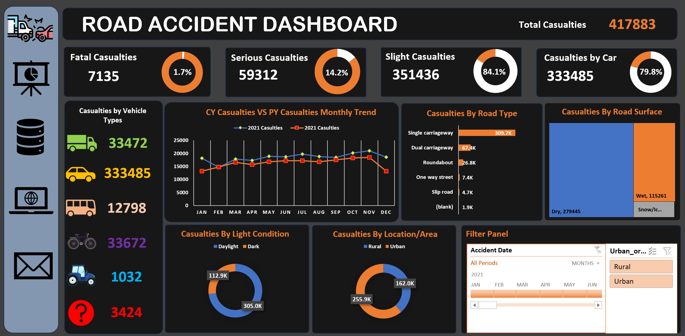
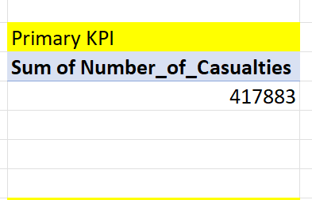
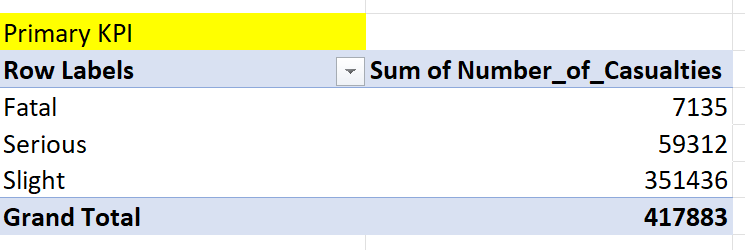
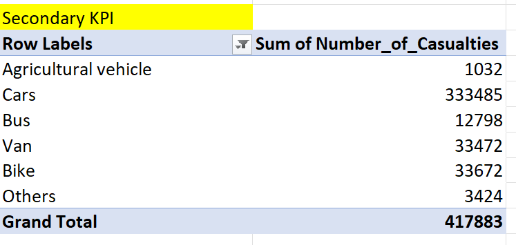
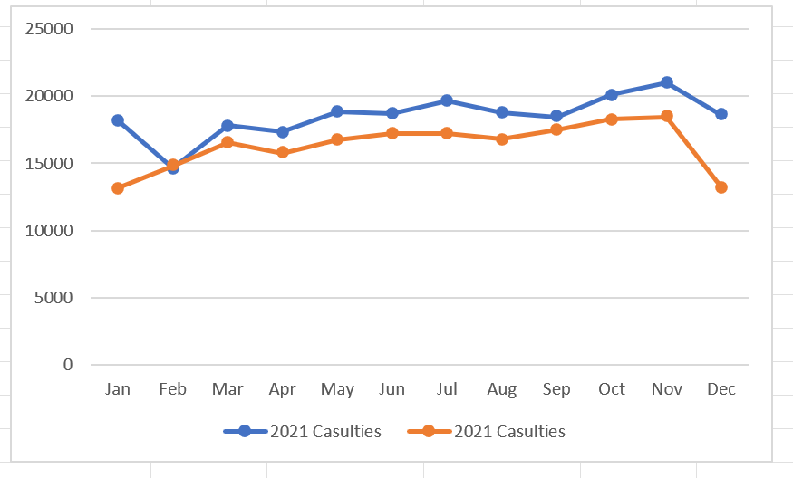

# 🚗 Road Accident Dashboard (2021–2022)

## 📌 Project Overview
This project analyzes road accident data for the years **2021** and **2022** to uncover key insights into accident severity, vehicle involvement, road conditions, and casualty distribution.  
The goal is to create an **Excel dashboard** that provides stakeholders with data-driven insights to improve road safety and decision-making.

---
## 🎯 Objectives

### 🏁 Primary KPIs
- **Total Casualties** – overall number of casualties recorded.
- **Casualty Percentage by Accident Severity** *(Fatal, Serious, Slight)*.
- **Maximum Casualties by Vehicle Type** – identifies which vehicle type contributes most to total casualties.

### ⚙️ Secondary KPIs
- **Total Casualties by Vehicle Type**.
- **Monthly Casualty Trend** comparing **Current Year (2022)** vs **Previous Year (2021)**.
- **Maximum Casualties by Road Type**.
- **Distribution of Casualties by Road Surface**.
- **Relation Between Casualties by Area (Urban/Rural)** and **Day/Night Conditions**.

## 🧠 Skills / Concepts Demonstrated

- **Data Cleaning & Preparation**
  - Handled missing and inconsistent data (e.g., corrected typos like *“Fetal” → “Fatal”*).
  - Ensured data accuracy by validating column entries and converting headers to filters.

- **Data Transformation**
  - Extracted **Month** and **Year** from the accident date using Excel formulas.
  - Created new calculated columns for time-based and categorical analysis.
  - Structured dataset for seamless Power BI integration.

- **Data Modeling & Relationships**
  - Built relationships between accident attributes (Severity, Vehicle Type, Location, Surface Condition).

- **Data Visualization (Power BI)**
  - Designed interactive dashboards showing:
    - Total and percentage casualties by severity.
    - Monthly trends (2021 vs 2022).
    - Casualty breakdown by road type, surface, and vehicle.
    - Urban/Rural & Day/Night comparison visuals.
  - Applied slicers, filters, and dynamic titles for improved usability.

- **Analytical Thinking**
  - Derived insights on high-risk vehicle types, time periods, and accident causes.
  - Identified correlations between accident severity and road conditions.

##  Data Visualization (Dashboard)

##  Primary KPIs
**Total Casualties** – overall number of casualties recorded
 
 
  

**Casualty Percentage by Accident Severity** *(Fatal, Serious, Slight)*.
 
 
  

**Total Casualties by Vehicle Type**.
 
 
  

**Monthly Casualty Trend** comparing **Current Year (2022)** vs **Previous Year (2021)**.
 
 
  

  
## 🏁 Conclusion & Summary

The **Road Accident Dashboard (2021–2022)** project provides a comprehensive analytical view of road accidents, focusing on identifying patterns and key factors contributing to casualties.  
Through data cleaning, transformation, and visualization, the dashboard highlights how accident severity, vehicle type, and road conditions influence total casualties.

Key takeaways include:
- **Cars and two-wheelers** accounted for the highest number of casualties.  
- **Fatal accidents**, though less frequent, contributed significantly to the total number of deaths.  
- **Urban areas** recorded more accidents overall, while **rural areas** had a higher fatality rate per incident.  
- **Weekend and nighttime accidents** showed a higher rate of severe casualties.  
- Casualties were more common on **single carriageways** and **dry road surfaces**, suggesting behavioral rather than environmental causes.

The dashboard enables stakeholders to:
- Monitor **accident trends year-over-year** (2021 vs 2022).  
- Understand **where and when** most casualties occur.  
- Make **data-driven policy decisions** for road safety improvements.

Overall, this project demonstrates a full end-to-end data analysis workflow — from **data cleaning and processing** in Excel to **insightful visualization** in Power BI — helping transform raw accident data into **actionable intelligence** for reducing future risks.
